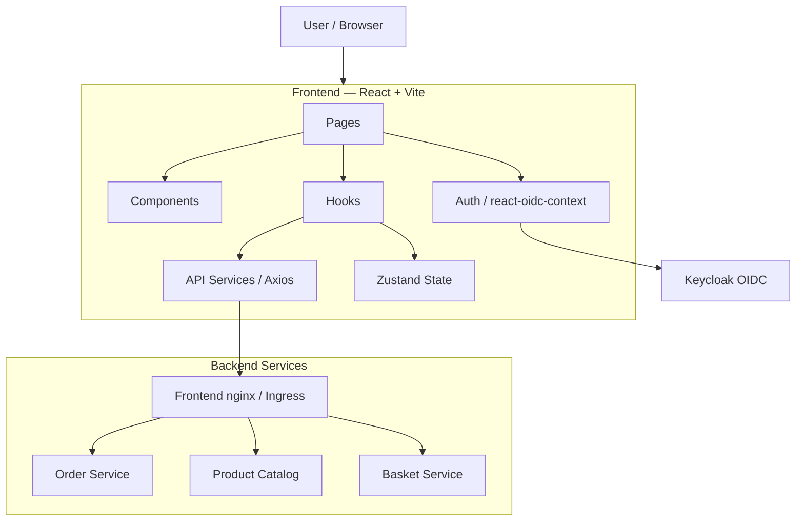
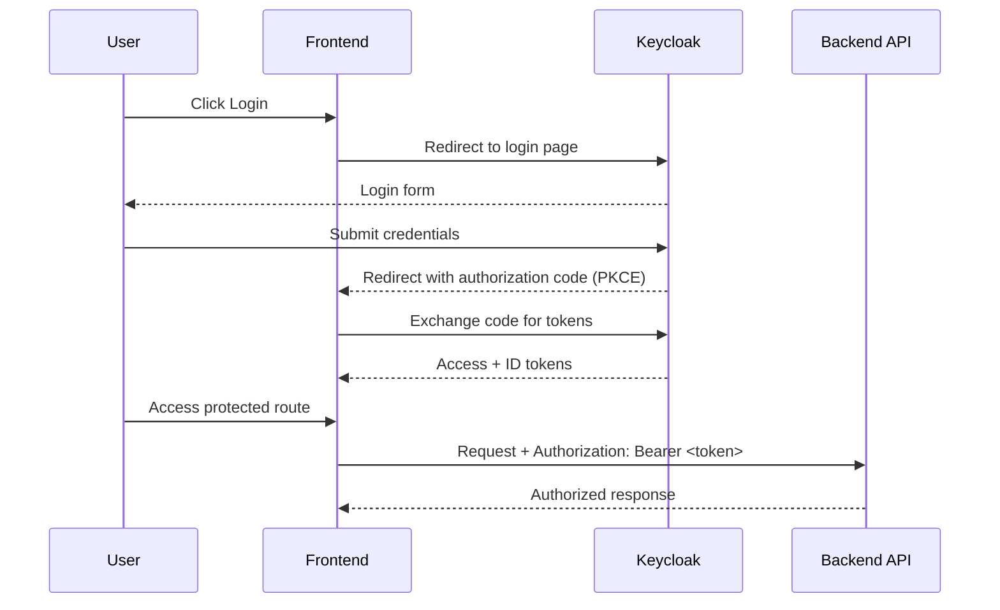

# Frontend — Architecture

## Overview

The frontend is a React 18 / TypeScript / Vite single-page application. It authenticates users via Keycloak OIDC and communicates with three backend services through an API Gateway.

## Component Diagram

## Authentication Flow

## Layer Responsibilities

| Layer | Libraries | Purpose |
|-------|-----------|---------|
| Pages | React Router 6 | Route-level components |
| Components | React 18 | Reusable UI elements |
| Hooks | TanStack Query, Zustand | Server and client state |
| Services | Axios | HTTP clients per backend service |
| Auth | oidc-client-ts, react-oidc-context | OIDC token lifecycle |

## Protected Routes

| Route | Auth Required |
|-------|---------------|
| `/cart` | Yes |
| `/orders` | Yes |
| `/orders/:id` | Yes |
| `/` `/products` | No |

## Deployment

- Packaged as a static build via `npm run build`
- Served by Nginx in a multi-stage Docker image
- Kubernetes manifests in `k8s/base/` (Kustomize)
