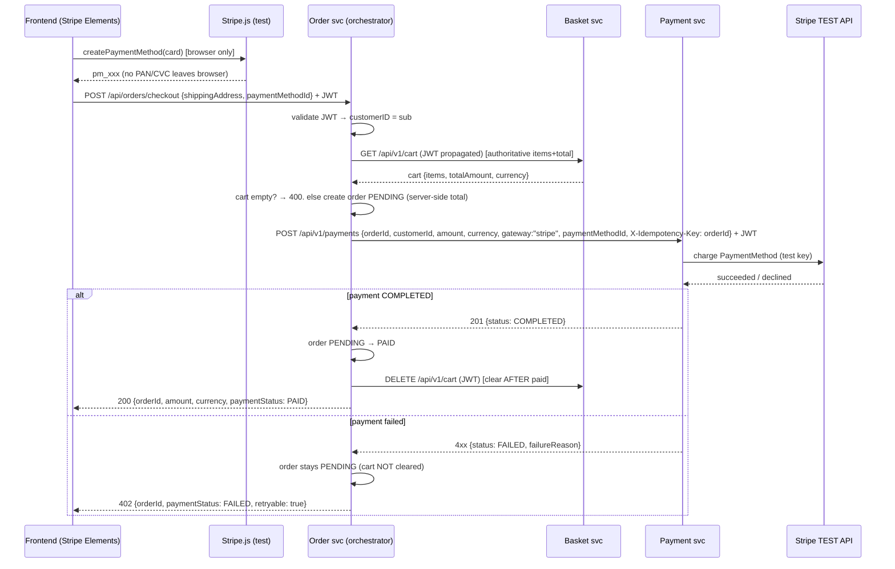

# Stripe checkout orchestration — design & phased delivery

**Status:** design approved (decisions locked); per-phase implementation specs to follow.
**Supersedes blocker:** `docs/issues/stripe-checkout-orchestration-blocker.md` (this is the resolution).
**Repos:** `shopping-cart-order` (orchestrator), `shopping-cart-payment` (Stripe), `shopping-cart-frontend` (Elements), `shopping-cart-basket` (cart-clear ownership), `shopping-cart-e2e-tests` (acceptance).

---

## Decisions locked

| Question | Decision |
|---|---|
| Where does orchestration live? | **Order service** — it owns order lifecycle, status transitions, and a RabbitPublisher. Add a synchronous, payment-aware checkout endpoint there. No new deployable. |
| What backs the "fake credit card"? | **Stripe test mode + Stripe Elements.** Frontend sends only a PaymentMethod ID; the payment service's `StripeGateway` charges Stripe's TEST API (test card `4242…`). Mock gateway retained for hermetic CI. |
| Order-ownership verification? | **Include Keycloak JWT auth on the order service now.** Required to verify ownership server-side. Mirror the existing basket validator. |

---

## Key findings (verified against code)

1. **`StripeGateway` is a stub.** `payment/go/internal/gateway/mock.go:130` returns `"Stripe gateway is not implemented yet (deferred to PR2)"`. Stripe test mode must be *implemented* (stripe-go SDK, PaymentMethod charge), not merely enabled.
2. **Basket already has a full Keycloak JWKS validator** — `basket/internal/auth/jwt.go` (`golang-jwt/jwt/v5`), config `OAUTH2_ENABLED` / `OAUTH2_ISSUER_URI` / `OAUTH2_CLIENT_ID`. Order-service auth is a **mirror**, not new design. (Note: basket module is `github.com/user/shopping-cart-basket`, order is `github.com/wilddog64/shopping-cart-order` — copy the code into order's own `internal/auth`, do not import across modules.)
3. **Order `/api/**` is currently unauthenticated** — `order/go/cmd/server/main.go:57` "PR1 intentionally leaves /api/** open. PR2 will add JWT middleware." That's this work.
4. **No consumer of `cart.checkout`** exists anywhere. Basket's `Checkout()` publishes the event and **clears the cart immediately** (`cart_service.go:257`), returning a cart copy — this is the root defect. Safe to retire the premature clear.
5. **Payment DTO accepts raw card fields** (`dto.go:17-20`: `CardNumber`, `CardCvc`, …). Our flow uses `paymentMethodId` **only**; these fields must never be populated by any component we build.
6. Payment endpoint already supports idempotency (`X-Idempotency-Key` header or `idempotencyKey` body field) and gateway selection (`gateway` field; router default `mock`). Config: `STRIPE_ENABLED`, `STRIPE_API_KEY`, `STRIPE_WEBHOOK_SECRET`.

---

## Target flow



**Invariant:** the cart is cleared **only** by the orchestrator, **only** after the order reaches `PAID`. The browser never decides an order is paid; amount/currency are recomputed server-side from the basket, never trusted from the client.

---

## Contracts

### New — Order service: `POST /api/orders/checkout` (authenticated)

Request (customerID comes from the JWT `sub`, **not** the body):
```json
{ "shippingAddress": { ... }, "paymentMethodId": "pm_xxx" }
```
Response 200 (paid):
```json
{ "orderId": "...", "amount": "42.00", "currency": "USD", "paymentStatus": "PAID" }
```
Response 402 (payment failed, retryable): same shape with `"paymentStatus": "FAILED"`, `"retryable": true`, and `failureReason`.

### Order → Payment call
`POST /api/v1/payments` with `gateway:"stripe"`, `paymentMethodId`, `X-Idempotency-Key: <orderId>`. Raw card fields left empty. JWT propagated.

### Order → Basket calls
`GET /api/v1/cart` (read authoritative cart) and `DELETE /api/v1/cart` (clear after paid) — both with the caller's JWT propagated.

### Basket change
Remove `cart.Clear()` from `Checkout()` (or retire `POST /api/v1/cart/checkout` entirely, since nothing else consumes `cart.checkout`). Frontend stops calling basket checkout.

### Frontend
Add `@stripe/stripe-js` + `@stripe/react-stripe-js`. Elements card form → `createPaymentMethod` → POST order `/checkout`. Publishable **test** key (`pk_test_…`) via build/env config (publishable keys are non-secret). Consume `{orderId, amount, currency, paymentStatus}`; surface retry/cancel.

---

## Cross-cutting

- **Auth propagation:** forward the inbound `Authorization: Bearer` header on every order→basket and order→payment hop. Payment must validate it (add the same mirrored validator if it doesn't already).
- **Idempotency:** key = `orderId`. Retrying the same order never double-charges (payment already de-dupes on the key).
- **Secrets:** Stripe **test** secret key → payment service `STRIPE_API_KEY` via ESO/Vault (never in git, never to frontend/basket/order/logs). Set `STRIPE_ENABLED=true`. Keep test keys/config isolated from prod (separate ExternalSecret / namespace values).
- **Compensation:** payment failure → order stays `PENDING`, cart intact; user retries `/checkout` (same order via idempotency) or cancels via the existing `POST /api/orders/:id/cancel` (authorized + audited). No new `PAYMENT_PENDING` status — `PENDING` suffices.

---

## Phased delivery

Each phase is an independent PR in its repo, gated and testable on its own. Branch name per repo: `feat/stripe-checkout-<phase>`.

| Phase | Repo | Branch | Scope | Acceptance |
|---|---|---|---|---|
| **A. Order JWT auth** | order | `feat/stripe-checkout-auth` | Mirror basket `internal/auth` + gin middleware; protect `/api/orders/**`; config `OAUTH2_*` (client id `order-service`) | Unauthed → 401; valid Keycloak JWT → 200; unit tests for validator |
| **B. Payment Stripe test gateway** | payment | `feat/stripe-checkout-gateway` | Implement `StripeGateway.ProcessPayment` via stripe-go using `PaymentMethodToken`; wire `STRIPE_API_KEY`; keep mock for CI | Test card `4242…` → COMPLETED against Stripe test API; declined test card → FAILED; mock path unchanged |
| **C. Order orchestrator** | order | `feat/stripe-checkout-orchestrator` | `POST /api/orders/checkout`: basket client (read cart), create PENDING, call payment, PAID on success, clear cart, compensation | Happy path → order PAID + cart cleared; payment fail → order PENDING + cart intact; ownership from JWT |
| **D. Basket stop premature clear** | basket | `feat/stripe-checkout-cart-clear` | Remove `cart.Clear()` from `Checkout()` / retire endpoint | Cart no longer clears at basket checkout; existing basket tests updated |
| **E. Frontend Elements** | frontend | `feat/stripe-checkout-elements` | Stripe deps, Elements form, PaymentMethod creation, call orchestrator, result/retry/cancel UI | Live test-card checkout → order confirmation; no PAN/CVC leaves browser |
| **F. e2e** | e2e-tests | `feat/stripe-checkout-e2e` | Fake-card flow: mock gateway (CI-hermetic) + Stripe test card (live smoke) | e2e green in CI on mock; documented live smoke with `4242…` |

**Dependency order:** A → C, B → C, C → E; D independent (do alongside C); F last. A and B can run in parallel.

---

## Security constraints (carry into every phase spec)

- Frontend uses Stripe Elements and sends **only** a PaymentMethod ID. No raw PAN/CVC anywhere — never populate payment's `cardNumber`/`cardCvc` fields.
- Stripe **secret** key stays server-side (payment only), via ESO/Vault. Publishable test key only on frontend.
- Server-side amount/currency authority — recompute from basket, never trust client.
- Every payment attempt carries a stable idempotency key (`orderId`).
- Test keys/cards isolated from production configuration.

## What NOT to do

- Do NOT clear the cart before the order is `PAID`.
- Do NOT let the client supply the amount, currency, or customerId.
- Do NOT send raw card data to any backend service.
- Do NOT commit Stripe secret keys; do NOT create PRs from these specs without the normal gates.
